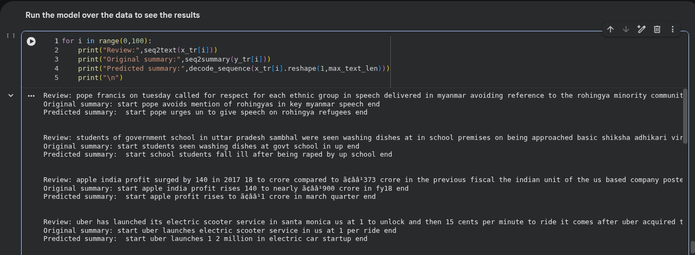
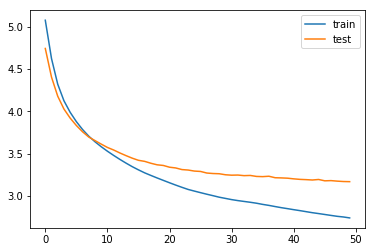

# 📰 Abstractive News Summarization — Seq2Seq LSTM


> End-to-end abstractive news headline generation using a stacked Seq2Seq LSTM encoder-decoder. Trained on ~98,000 Indian news article/headline pairs — covering the full pipeline from raw text to greedy-decoded headline prediction.

---

<!--
  📸 ADD DEMO HERE — best placement: right here, below badges, above the fold
  Steps:
  1. Run the inference loop in the notebook on a few custom news articles
  2. Screenshot the input → predicted headline output
  3. Save as reports/figures/demo.png or demo.gif
  4. Uncomment the line below:
-->
  


---

## 📌 Table of Contents
- [Overview](#overview)
- [Project Structure](#project-structure)
- [Dataset](#dataset)
- [Methodology](#methodology)
- [Model Architecture](#model-architecture)
- [Results](#results)
- [Sample Predictions](#sample-predictions)
- [How to Run](#how-to-run)
- [Key Findings](#key-findings)
- [Tech Stack](#tech-stack)
- [Future Work](#future-work)

---

## Overview

This project builds an **abstractive text summarization system** — generating new headline text rather than extracting existing sentences. The encoder reads a news article; the decoder generates a headline token by token.

Abstractive summarization is significantly harder than extractive — the model must learn language generation, not just sentence selection.

---

## Project Structure

```
news-summarization-seq2seq/
│
├── notebooks/
│   └── news_summarization_seq2seq.ipynb   # Full pipeline: EDA → training → inference
│
├── src/
│   ├── __init__.py
│   ├── preprocess.py    # Data merging, regex cleaning, spaCy pipeline, length filtering
│   ├── model.py         # Stacked Seq2Seq LSTM architecture + inference model builders
│   └── inference.py     # decode_sequence(), seq2text(), seq2summary(), summarize()
│
├── data/
│   └── raw/README.md    # Kaggle download instructions (data not committed)
│
├── models/              # Saved .h5 weights (gitignored due to size)
│
├── reports/
│   └── figures/
│       └── training_curve.png   # Train vs val loss across 50 epochs
│
├── tests/
│   └── test_preprocess.py       # 17 unit tests (pytest)
│
├── .github/workflows/ci.yml
├── requirements.txt
├── conftest.py
├── .gitignore
└── README.md
```

---

## Dataset

**Source:** [Kaggle — News Summary](https://www.kaggle.com/datasets/sunnysai12345/news-summary) (License: GPL-2.0)

Two CSV files are merged:

| File | Columns used | Records |
|------|-------------|---------|
| `news_summary_more.csv` | `text`, `headlines` | ~55,000 |
| `news_summary.csv` | `author + date + read_more + text + ctext` → `text`, `headlines` | ~4,500 |

**After merging and cleaning:** ~98,353 text/summary pairs  
**After length filtering:** 88,517 train + 9,836 validation = **98,353 total**

Coverage thresholds used:
- Text ≤ 100 words: **95.78%** of samples retained
- Summary ≤ 15 words: **99.78%** of samples retained

---

## Methodology

### Pipeline Overview

```
Two CSVs (news_summary.csv + news_summary_more.csv)
      │
      ▼
[Data Merging — preprocess.py]
  └─ Concatenate text/headline pairs from both sources
      │
      ▼
[Text Cleaning — text_strip()]
  ├─ Remove: \t \r \n, repeated punctuation (--, __, ~~, ..)
  ├─ Remove: special chars < > ( ) | & © ø [ ] ' " , ; ? ~ * !
  ├─ Normalize: INC/CM ticket numbers, mailto:, hex escapes
  ├─ URL simplification: keep domain only, drop path
  └─ Lowercase, collapse spaces
      │
      ▼
[spaCy NLP Pipeline — en_core_web_sm]
  ├─ Texts: batch_size=1000, n_process=-1  (~3.93 mins on CPU)
  └─ Summaries: wrapped with _START_ ... _END_ then sostok ... eostok
      │
      ▼
[Tokenization & Rare Word Removal]
  ├─ Source vocab: threshold=4 → 57.9% rare words → 1.34% corpus coverage → keep 33,412 words
  └─ Target vocab: threshold=6 → 66.3% rare words → 3.57% corpus coverage → keep 11,581 words
      │
      ▼
[Padding]
  ├─ x: pad_sequences(maxlen=100, padding='post')
  └─ y: pad_sequences(maxlen=15,  padding='post')
      │
      ▼
[Empty Summary Removal]
  └─ Drop rows where tokenized summary has only 2 non-zero tokens (just start/end)
      │
      ▼
[Train/Val Split — 90/10, stratified, random_state=0]
  ├─ Train: 88,517 pairs
  └─ Val:    9,836 pairs
      │
      ▼
[Seq2Seq LSTM Model — model.py]
  └─ 3-layer stacked encoder + 1-layer decoder, 15.1M parameters
      │
      ▼
[Greedy Decoding — inference.py]
  └─ Token-by-token generation until eostok or max_summary_len
```

---

## Model Architecture

```
ENCODER
  Input(shape=(100,))
  → Embedding(33412, 200, trainable=True)           [6,682,400 params]
  → LSTM(300, return_seq=True, dropout=0.4)          [601,200 params]
  → LSTM(300, return_seq=True, dropout=0.4)          [721,200 params]
  → LSTM(300, return_seq=True, dropout=0.4)          [721,200 params]
  → (encoder_outputs[100×300], state_h, state_c)

DECODER
  Input(shape=(None,))
  → Embedding(11581, 200, trainable=True)            [2,316,200 params]
  → LSTM(300, return_seq=True, initial_state=[h, c]) [601,200 params]
  → TimeDistributed(Dense(11581, softmax))           [3,485,881 params]

Total trainable parameters: 15,129,281
Optimizer: RMSprop  |  Loss: Sparse Categorical Crossentropy
```

No attention mechanism — this is a **vanilla Seq2Seq baseline**. The encoder compresses the full article into two state vectors (h, c) of size 300, which is the only context the decoder receives.

---

## Results

### Training Curve



### Loss Progression (50 Epochs)

| Epoch | Train Loss | Val Loss |
|-------|-----------|---------|
| 1 | 5.078 | 4.744 |
| 10 | 3.581 | 3.612 |
| 20 | 3.183 | 3.359 |
| 30 | 2.970 | 3.249 |
| 40 | 2.848 | 3.201 |
| **50** | **2.739** | **3.168** |

EarlyStopping (patience=2) did not trigger — val_loss continued decreasing through all 50 epochs, indicating the model was still learning. Training time: approximately ~5.7ms/sample × 88,517 samples × 50 epochs ≈ **~6 hours on CPU**.

The gap between train (2.739) and val (3.168) loss suggests mild overfitting, expected for a model of this size on this dataset size without attention.

---

## Sample Predictions

Greedy-decoded on training samples. Predictions show **the model has learned article-to-headline generation**, but struggles with factual precision — a known limitation of vanilla Seq2Seq without attention.

| Article (truncated) | Original Headline | Predicted Headline |
|---------------------|------------------|-------------------|
| pope francis called for respect for each ethnic group in speech in myanmar avoiding reference to rohingya... | pope avoids mention of rohingyas in key myanmar speech | pope urges un to give speech on rohingya refugees |
| apple india profit surged by 140 in 2017-18 to crore... | apple india profit rises 140 to nearly ₹900 crore in fy18 | apple profit rises to ₹1 crore in march quarter |
| uber has launched its electric scooter service in santa monica at $1 to unlock... | uber launches electric scooter service in us at $1 per ride | uber launches 1-2 million in electric car startup |
| sc bans all construction in maharashtra, mp, uttarakhand and chandigarh... | sc bans construction in maharashtra mp uttarakhand | sc bans construction of maharashtra mp uttarakhand cm |
| bjp crosses halfway mark leading in 112 seats in karnataka elections... | bjp crosses halfway mark leads in 112 seats in taka polls | bjp crosses 100 seats in taka polls |

**Observations:** The model captures topic and key entities well but loses numerical precision and specific details — consistent with the information bottleneck of a state-vector-only context passing.

---

## How to Run

### 1. Clone
```bash
git clone https://github.com/YOUR_USERNAME/news-summarization-seq2seq.git
cd news-summarization-seq2seq
```

### 2. Install dependencies
```bash
pip install -r requirements.txt
python -m spacy download en_core_web_sm
```

### 3. Download dataset
Download from [Kaggle](https://www.kaggle.com/datasets/sunnysai12345/news-summary) and place both CSVs in `data/raw/`.

### 4. Run the notebook
```
notebooks/news_summarization_seq2seq.ipynb
```

### 5. Run inference on custom text (after training)
```python
from src.inference import summarize

article = """
Apple has announced the launch of its new iPhone 16 series featuring
an upgraded A18 chip, improved camera system, and a new action button.
The devices will be available starting September 20 across major markets.
"""

headline = summarize(
    article,
    x_tokenizer=x_tokenizer,
    encoder_model=encoder_model,
    decoder_model=decoder_model,
    target_word_index=target_word_index,
    reverse_target_word_index=reverse_target_word_index,
)
print(headline)
# → 'apple launches new iphone with camera and chip'
```

### 6. Run tests
```bash
pytest tests/ -v
```

---

## Key Findings

- **Vocabulary coverage after rare word removal**: keeping words with frequency ≥ 4 (source) and ≥ 6 (target) removes ~60–66% of unique words but only ~1–4% of total word occurrences — confirming the long-tail distribution of rare words in news text
- **EarlyStopping never triggered**: val_loss decreased monotonically across all 50 epochs, suggesting training could benefit from more epochs or a higher patience value
- **Train-val loss gap (~0.43)**: indicates mild overfitting, but the model generalises reasonably given no attention mechanism
- **Topic capture is strong**: predicted headlines correctly identify the subject entity and event type in most cases
- **Numerical/factual precision is weak**: numbers, percentages, and proper noun specifics are often wrong — a direct consequence of the information bottleneck (single [h,c] state vector carrying 100-token article context)
- **The model is a strong baseline**: further gains require attention (Luong/Bahdanau) or transformer-based approaches

---

## Tech Stack

| Category | Libraries |
|----------|-----------|
| Data | pandas, numpy |
| Text Cleaning | regex, Python stdlib |
| NLP | spaCy (`en_core_web_sm`) |
| Deep Learning | TensorFlow 2.x, Keras |
| Tokenization | `keras.preprocessing.text.Tokenizer` |
| Training | `EarlyStopping`, RMSprop |
| Evaluation | Train/val loss curves |
| Testing | pytest |

---

## Future Work

- [ ] Add **Bahdanau / Luong attention** — directly addresses the information bottleneck; expected to significantly improve factual precision
- [ ] Replace Seq2Seq with **transformer encoder-decoder** (T5, BART, PEGASUS fine-tuning)
- [ ] Add **ROUGE scoring** (ROUGE-1, ROUGE-2, ROUGE-L) for quantitative evaluation
- [ ] Implement **beam search decoding** instead of greedy decoding
- [ ] Train with a **coverage mechanism** to reduce repetition in generated summaries
- [ ] Build a **Streamlit demo app** for live summarization

---

## License
MIT License — see [LICENSE](LICENSE) for details.

---

## Author
**Mahesh Jakkala** | [LinkedIn](https://www.linkedin.com/in/mahesh-jakkala-6632b330b/) | [Kaggle](https://www.kaggle.com/jakkalamahesh)

> *"The encoder reads. The decoder speaks. The gap between them is where understanding lives."*
